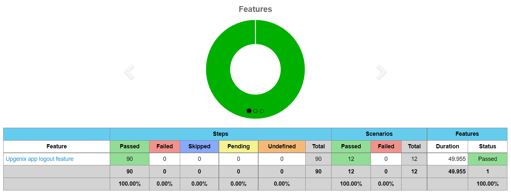

# Testinium-QA
Automating the Testinium browser  (JAVA, Selenium, Cucumber, JUnit, Jira, Jenkins)

### Tools

<p align="left"> 

<a href="https://www.java.com" target="_blank" rel="noreferrer"> 
   
</a> 

<a href="https://www.selenium.dev" target="_blank" rel="noreferrer">
   
</a>    

<a href="https://www.oracle.com/" target="_blank" rel="noreferrer"> 
   
</a>

<a href="https://encrypted-tbn0.gstatic.com/images?q=tbn:ANd9GcSPEOYG6Ap6vFoqv5bNXkDvnCa1yAqbDr_f_YQhXa97QwYXvNqWIvnCzpFJJz1ZwcLrwbM&usqp=CAU" rel="noreferrer">
   
</a> 
<a href="https://encrypted-tbn0.gstatic.com/images?q=tbn:ANd9GcSPEOYG6Ap6vFoqv5bNXkDvnCa1yAqbDr_f_YQhXa97QwYXvNqWIvnCzpFJJz1ZwcLrwbM&usqp=CAU" rel="noreferrer">
   
</a> 
<a href="https://encrypted-tbn0.gstatic.com/images?q=tbn:ANd9GcSPEOYG6Ap6vFoqv5bNXkDvnCa1yAqbDr_f_YQhXa97QwYXvNqWIvnCzpFJJz1ZwcLrwbM&usqp=CAU" rel="noreferrer">
   
</a> 
</p>

* JAVA
* SELENIUM
* CUCUMBER
* JUNIT
* JIRA
* JENKINS

### Testinium-QA

This repository contains a collection of sample `Testinium-QA` projects and libraries that demonstrate how to
use the tool and develop automation script using the Cucumber BDD framework with Java as programming language.
It generate JSON, HTML and Txt reporters as well. It also generate `screen shots` for your tests if you enable it and
also generate `error shots` for your failed test cases as well.

### Installation (pre-requisites)

1. JDK 1.8+ 
2. Maven 
3. IntelliJ
4. IntelliJ Plugins for
    - Maven
    - Cucumber
5. Browser driver (make sure you have your desired browser driver and class path is set)

### Framework set up

Git:

    git clone https://github.com/BalamiRR/Testinium-QA.git
 
Manually :

Fork / Clone repository from [here](https://github.com/IdrisSaifee/Testinium-QA/archive/main.zip) or download zip and set
it up in your local workspace.


### Using canned test in the project:


```
import io.cucumber.junit.Cucumber;
import io.cucumber.junit.CucumberOptions;
import org.junit.runner.RunWith;

@RunWith(Cucumber.class)
@CucumberOptions(
    plugin = {
        "html:target/cucumber-reports.html",
        "json:target/cucumber.json",
        "rerun:target/rerun.txt",
        "me.jvt.cucumber.report.PrettyReports:target/cucumber"
    },
    features = "src/main/resources/features",
    glue = "com/testinium/step_definitions",
    dryRun = false,
    tags = "@LogOut"
)
public class CukesRunner {

}

```

### Develop automation scripts using BDD approach - Cucumber-Java

There are already many predefined StepDefinitions which is packaged under `/step_definitions/LoginSD.java` will help you speed
up your automation development that support both your favorite workaday helpers methods.

Tests are written in the Cucumber framework using the Gherkin Syntax.
Here is one of the scenarios:

```
@Login
Feature: Testinium app login feature
  User Story:
  As a user, I should be able to login with correct credentials to different accounts.

  Accounts are: PosManager, SalesManager

  Background: For the scenarios in the feature file, user is expected to be on login page
    Given User is on the Testinium login page

  #1-Users can log in with valid credentials (We have 5 types of users but will test only 2 user: PosManager, SalesManager)
  @UPGN-286
  Scenario Outline: Users log in with valid credentials
    When User enters "<username>" username
    And User enters "<password>" password
    And User clicks the login button
    Then User should see the dashboard
  
  #2-"Wrong login/password" should be displayed for invalid (valid username-invalid password and invalid username-valid password) credentials
  @UPGN-287
  Scenario Outline: Users log in with invalid email or invalid password credentials
    When User enters "<username>" username
    And User enters "<password>" password
    And User clicks the login button
    Then User sees error message
    
  #3- "Please fill out this field" message should be displayed if the password or username is empty
  @UPGN-288
  Scenario Outline:Users log in with invalid email or invalid password credentials
    When User enters "<password>" username
    And User clicks the login button
    Then User sees "Veuillez renseigner ce champ." message

    @SalesManager
    Examples: SalesManager's username and password
      |username               |password    |
      |salesmanager7@info.com |salesmanager|
      |salesmanager8@info.com |salesmanager|
      |salesmanager9@info.com |salesmanager|
      
    @PosManager
    Examples: PosManager's username and password
      |username               |password  |
      |posmanager5@info.com   |posmanager|
      |posmanager6@info.com   |posmanager|
```


### Jenkins Cucumber Reports


##### HTML Report:

To generate HTML report use  `mvn test -Dcucumber.options="–plugin html:target/cucumber-reports.html"`

##### Txt Report:

To generate a Txt report Use `mvn test -Dcucumber.options="–plugin rerun:target/rerun.txt"`

### Jira Test Execution

  
  

  

### THE END

